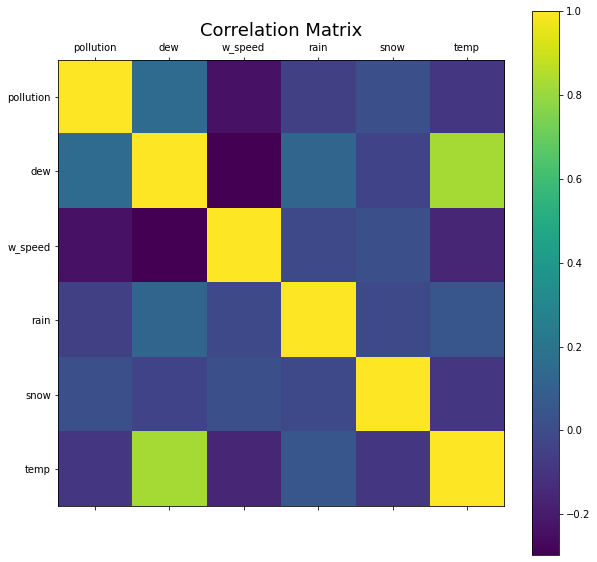
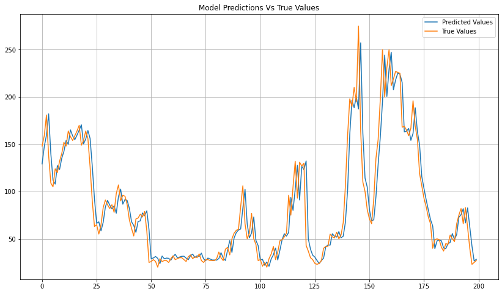

# Beijing Air Quality
## About

Predicting air quality plays a crucial role in safeguarding public health by proactively mitigating exposure to hazardous levels of pollution. The importance of this role becomes even more pronounced for individuals who suffer from respiratory conditions, as they are particularly vulnerable to the risks of unfavorable air quality conditions.

According to the <a href=https://www.airnow.gov/aqi/aqi-basics/>US Environmental Protection Agency (EPA)</a> the Air Quality Index (AQI) is divided into 6 categories according to a different level of health concern. These categories of AQI (in ug/m^3) of ozone and particle pollution are as follows:
 

  

 

We are going to perform multivariate time series forecasting employing deep learning on <a href=https://archive.ics.uci.edu/dataset/381/beijing+pm2+5+data>Beijing US Ambassy Air Quality dataset</a> which consists of 43824 samples of hourly data of different weather conditions and pollution (pm2.5) level collected between January 1st of 2010 and December 31st of 2014 on the US ambassy of Beijing. The dataset has the following three variables: 

<ul>
<li><b>No:</b> row number
<li><b>Year:</b> year the data point was captured
<li><b>Month:</b> month the data point was captured
<li><b>Day:</b> day the data point was captured
<li><b>Hour:</b> hour the data point was captured
<li><b>pm2.5:</b> concentration (in ug/m^3) of particulate matter with a circumference of 2.5 microns 
<li><b>DEWP:</b> dew point
<li><b>TEMP:</b> temperature
<li><b>PRES:</b> pressure
<li><b>cbwd:</b> combined wind direction
<li><b>Iws:</b> cumulated wind speed
<li><b>Is:</b> cumulated hours of snow
<li><b>Ir:</b> cumulated hours of rain
</ul>

## Procedure

The objective will be to develop an effective model to predict ahead of time the concentration levels of pm2.5 and thus detect potential health risks and raise awareness on it to prevent exposure. The main metric for success we are going to use is the mean absolute error.
The steps will be:
<ol>
<li>Loading and Cleaning Data
<li>Exploring Data
<li>Data Preprocessing
<li>Model development
<li>Model evaluation
</ol>

## Loading & Cleaning the data

It seems clear at first look that our dataset needs some cleaning. To begin with, the variables names are a bit confusing the way they are defined right now so we should rename them. Date variables need to be parsed and set as index and variable 'No' serves no real purpose so we will drop it.

We confirm there are missing values in the pm2.5 variable as can be seen in the graph below, exactly 2067, we decide to fill these missing values with zeros and let the model interpret them as missing. There are only two null values in the series which are most likely outliers so it will not significantly affect our model to have them set as missing values.
 

  

 

Once the date has been parsed and set as index, the columns 'No', 'Year', 'Month', 'Day' and 'Hour' dropped, clearer columns names have been set, missing values set as zero and the first day of data dropped, since it was missing pm2.5 values and we need the initial values start the training of our model, we can move forward to exploring the data
 

## Exploring the data

First of all, let's examine the monthly average levels of pm2.5 concentration to get a measure of how they would be classified in the AQI categories:

 

  

 

We can see they are overall Moderate with some months at the beginning and the end of the year being Unhealthy for sensitive groups. However, these are just the averages, just by looking at the following plot we can see some spikes above these levels and possible outliers that far exceed them. 

 

  

 

Looking at each variable boxplot distribution we can further asses our last statement, seeing how wind speed and pollution show the greatest standard deviation and pressence of possible univariate outliers, however, without fully grasping the circumnstances around these data points at the time of their collection it's hard to confidently classify them as such.

 

  

 

From the correlation matrix we can see wind speed is negatively correlated to pollution (-0.2) which seems logical since wind can cause pollution particles to disperse, however, there is no significant correlation between the remaining variables except for the expected dew-temp. This makes the problem more challenging for any statistical based approach, hence why we will use Deep Learning.

 

  

 

## Data Preprocessing

We will proceed to encode the categorical variables, in this case only the wind direction and scale the dataset using a MinMaxScaler. Then since we are in a forecasting problem we will generate the sequences to train our model, we will be keeping it simple and using 1 lagged timestep and forecasting 1 timestep ahead, but this can be easily modified in code for different approaches and testing.

Finally, after finishing arranging data as sequences we will split data into training and test. We will be using the first year of data (8760 data points) as testing and the remaining ones (35038 data points) as training.

## Model Development and Evaluation

We will be training a simple LSTM model, with adam optimizer and mean absolute error as our loss metric, the network design consists of:
<ul>
<li>Input LSTM Layer (32 Neurons)
<li>Dropout Layer (0.2 Dropout rate)
<li>LSTM Layer (16 Neurons)
<li>Output Dense Layer (1 Neuron)
</ul>

 

After training the network for 8 epochs with a batch size of 72 we obtain the following results:
 

  

 

|  | MAE | RMSE | R2 Score |
|----------|----------|----------|----------|
| LSTM    | 0.01524  | 0.03084  | 0.89107  |

Model's results are good, the predicted values seem to follow the series distribution accurately with a R2 score of <b>0.89</b>, an average absolute error of <b>15.15</b> (unscaled) and a higher root mean squared error of <b>30.65</b> (unscaled) which is to be expected given the nature of the time series (its spikes and possible outliers) and that this metric penalizes larger errors more.

We could further attempt to optimize the network design however, this simple design seems to be providing a good enough performance to confidently provide accurate predictions on which AQI Category the pm2.5 level will fall, and complicating it with the risk of overfitting and adding unnecesary parameters might not be worth the squeeze. Below can be seen how the model predictions fare against the true values.
 

  

 
